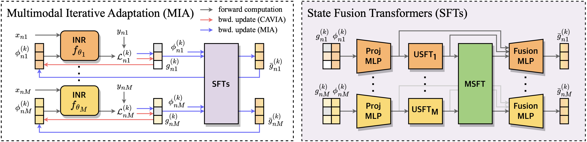

# MIA

Welcome to the official implementation of our TMLR paper: [Meta-Learning Approach for Joint Multimodal Signals with Multimodal Iterative Adaptation](https://openreview.net/pdf?id=LV04KBaIQt).

This repository offers the tools and scripts needed to replicate the experiments detailed in our paper. It includes the implementation of the MIA algorithm, as well as several baseline methods like CAVIA, MetaSGD, ALFA, and GAP, to enable thorough comparison.



## Setup

To get started, follow these steps to set up your environment:

```bash
git clone git@github.com:yhytoto12/mia.git
cd mia

conda create -n mia python=3.10
conda activate mia

pip install -r requirements.txt
```

All required packages are listed in `requirements.txt`.

## Datasets

#### Multimodal Synthetic Functions
We provide a dataset comprising joint synthetic functions, including sine, tanh, Gaussian, and ReLU functions.

#### CelebA Dataset
The CelebA dataset, annotated with RGB images, normal maps, and sketches, serves as a real-world testbed for multimodal learning.

You can download both datasets from our [Google Drive](https://drive.google.com/drive/folders/1HGOSK7B25zFuMCOVV1dcU7Idnw1Fz4ix?usp=sharing). After downloading, place them in the `datasets/synthetic` or `datasets/celeba` for each dataset.

## Run Scripts

All scripts necessary to run experiments are located in the `runner/` directory. We provide scripts to run experiments using different algorithms, including our proposed MIA method.

### Synthetic Experiments

To run experiments on the synthetic multimodal dataset using MIA:
```bash
python runner/run_synthetic.py MIA
```

You can replace `MIA` with any other method such as `CAVIA`, `MetaSGD`, `ALFA`, or `GAP` to test those algorithms.

### CelebA Experiments

To run experiments on the CelebA dataset using MIA:
```bash
python runner/run_celeba.py MIA
```

As with synthetic experiments, you can substitute `MIA` with other method names to run baseline experiments.

## Results

After running the experiments, results will be stored in the `results/` directory. Each experiment will generate logs, model checkpoints, and performance metrics. You can visualize these results using the provided visualization scripts or by using your preferred data analysis tools.

## Citation

If you find our work useful in your research, please consider citing our paper:
```bibtex
@article{
   lee2024mia,
   title={Meta-Learning Approach for Joint Multimodal Signals with Multimodal Iterative Adaptation},
   author={Sehun Lee and Wonkwang Lee and Gunhee Kim},
   journal={Transactions on Machine Learning Research},
   issn={2835-8856},
   year={2024},
   url={https://openreview.net/forum?id=LV04KBaIQt},
}
```